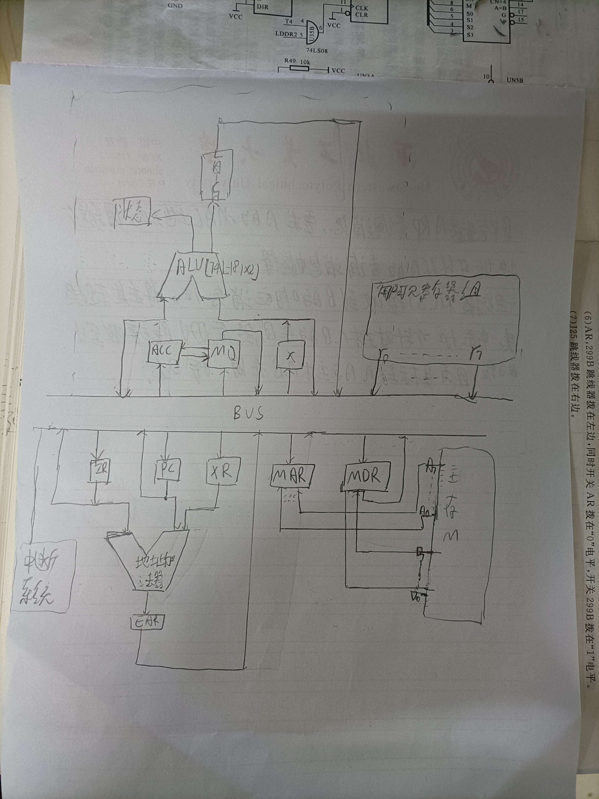
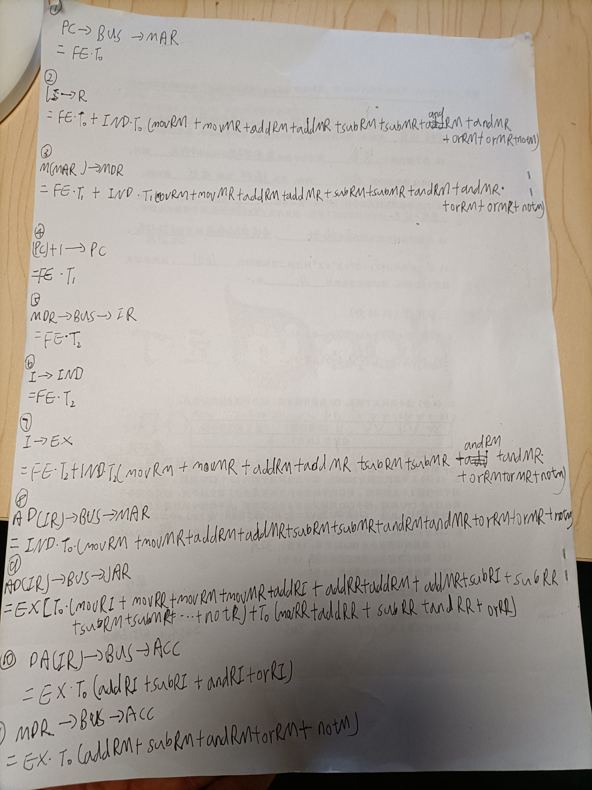
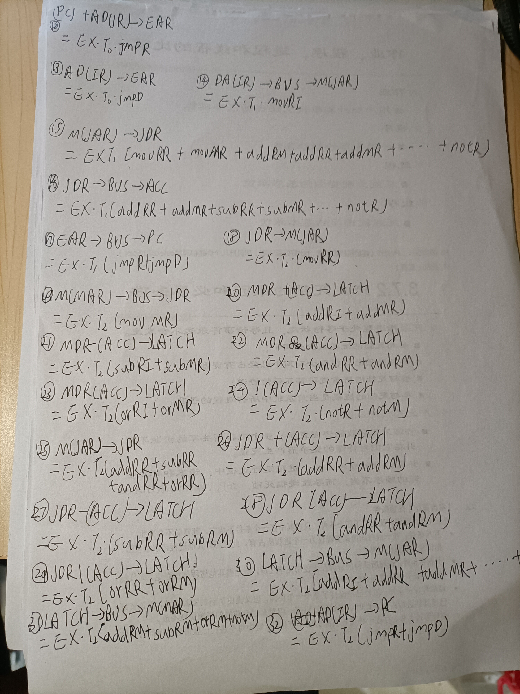

# cpu设计

## 指令集及其设计
### 需求分析
1. 由于有8种不同的操作指令，故需要3位操作码来区分不同的操作指令

| mov | add | sub | and | or  | not | jmp | hlt |
|-----|-----|-----|-----|-----|-----|-----|-----|
| 000 | 001 | 010 | 011 | 100 | 101 | 110 | 111 |
2. 所有指令的两个操作数不能同时为内存操作数,即可以有立即数寻址和寄存器寻址等非直接访存指令
3. 支持立即寻址、直接寻址、寄存器直接寻址和相对寻址四种寻址方式。由2，立即寻址、直接寻址应与寄存器寻址两两互相组合；
相对寻址常用于跳转，这里也用于跳转；目的操作数不能为立即寻址方式。
4. 采用 1 字节或者 2 字节变长指令字，操作码采用定长格式。可设定每一条指令的左操作数为目的操作数, 右操作数为源操作数，
并在操作数前面加上寻址特征用于区分不同寻址方式。

### 指令格式设计
- 双操作数寻址方式与寻址特征(共4种)如下：
 
| 寻址方式 | 寄存器寻址-立即寻址 | 寄存器寻址-寄存器寻址 | 寄存器寻址-直接寻址 | 直接寻址-寄存器寻址 |
|------|------------|-------------|------------|------------|
| 寻址特征 | 00         | 01          | 10         | 11         |
- 单操作数指令not寻址方式有两种，如下（由于采用定长操作码，仍取2位，下同）：

| 寻址方式 | 直接寻址 | 寄存器寻址 |
|------|------|-------|
| 寻址特征 | 00   | 01    |
- 单操作数jmp指令有相对偏移与绝对偏移2种寻址方式。相对偏移即相对寻址, 跳转后的地址
为PC当前值+jmp指令的操作数。绝对偏移即立即寻址, 直接跳转到jmp指令的操作数代表的地址。
如下：

| 寻址方式 | 相对寻址 | 直接寻址 |
|------|------|------|
| 寻址特征 | 00   | 01   |
各指令中不同操作数的长度：
- 立即数寻址操作数长度取决于剩下指令位数；
- 共有$8=2^3$个用户可见寄存器，所以寄存器寻址有3位操作数长度；
- 可访问$2^8$字节的地址空间，所以直接寻址有8位操作数长度。
### 指令集设计

#### ***mov***

分为以下几种情况:

**movRI**

| 操作码 | 寻址特征 | 左操作数:寄存器编号(3位) | 右操作数:立即数(8位) |
| ------ | -------- | ------------------------ | -------------------- |
| 000    | 00       | xxx                      | xxxxxxxx             |

**movRR**

| 操作码 | 寻址特征 | 空码  | 左操作数:寄存器编号(3位) | 右操作数:寄存器编号(3位) |
| ------ | -------- | ----- | ------------------------ | ------------------------ |
| 000    | 01       | 00000 | xxx                      | xxx                      |

**movRM**

| 操作码 | 寻址特征 | 左操作数:寄存器编号(3位) | 右操作数:内存地址编号(8位) |
| ------ | -------- | ------------------------ | -------------------------- |
| 000    | 10       | xxx                      | xxxxxxxx                   |

**movMR**

| 操作码 | 寻址特征 | 左操作数:主存地址编号(8位) | 右操作数:寄存器编号(3位) |
| ------ | -------- | -------------------------- | ------------------------ |
| 000    | 11       | xxxxxxxx                   | xxx                      |

#### ***add***

同mov, 分为以下几种情况:

**addRI**

| 操作码 | 寻址特征 | 左操作数:寄存器编号(3位) | 右操作数:立即数(8位) |
| ------ | -------- | ------------------------ | -------------------- |
| 001    | 00       | xxx                      | xxxxxxxx             |

**addRR**

| 操作码 | 寻址特征 | 空码  | 左操作数:寄存器编号(3位) | 右操作数:寄存器编号(3位) |
| ------ | -------- | ----- | ------------------------ | ------------------------ |
| 001    | 01       | 00000 | xxx                      | xxx                      |

**addRM**

| 操作码 | 寻址特征 | 左操作数:寄存器编号(3位) | 右操作数:内存地址编号(8位) |
| ------ | -------- | ------------------------ | -------------------------- |
| 001    | 10       | xxx                      | xxxxxxxx                   |

**addMR**

| 操作码 | 寻址特征 | 左操作数:内存地址编号(8位) | 右操作数:寄存器编号(3位) |
| ------ | -------- | -------------------------- | ------------------------ |
| 001    | 11       | xxxxxxxx                   | xxx                      |

#### ***sub***

同mov, 分为以下几种情况:

**subRI**

| 操作码 | 寻址特征 | 左操作数:寄存器编号(3位) | 右操作数:立即数(8位) |
| ------ | -------- | ------------------------ | -------------------- |
| 010    | 00       | xxx                      | xxxxxxxx             |

**subRR**

| 操作码 | 寻址特征 | 空码（5位）  | 左操作数:寄存器编号(3位) | 右操作数:寄存器编号(3位) |
| ------ | -------- | ----- | ------------------------ | ------------------------ |
| 010    | 01       | 00000 | xxx                      | xxx                      |

**subRM**

| 操作码 | 寻址特征 | 左操作数:寄存器编号(3位) | 右操作数:主存地址编号(8位) |
| ------ | -------- | ------------------------ | -------------------------- |
| 010    | 10       | xxx                      | xxxxxxxx                   |

**subMR**

| 操作码 | 寻址特征 | 左操作数:内存地址编号(8位) | 右操作数:寄存器编号(3位) |
| ------ | -------- | -------------------------- | ------------------------ |
| 010    | 11       | xxxxxxxx                   | xxx                      |

#### ***and***

同mov, 分为以下几种情况:

**andRI**

| 操作码 | 寻址特征 | 左操作数:寄存器编号(3位) | 右操作数:立即数(8位) |
| ------ | -------- | ------------------------ | -------------------- |
| 011    | 00       | xxx                      | xxxxxxxx             |

**andRR**

| 操作码 | 寻址特征 | 空码  | 左操作数:寄存器编号(3位) | 右操作数:寄存器编号(3位) |
| ------ | -------- | ----- | ------------------------ | ------------------------ |
| 011    | 01       | 00000 | xxx                      | xxx                      |

**andRM**

| 操作码 | 寻址特征 | 左操作数:寄存器编号(3位) | 右操作数:内存地址编号(8位) |
| ------ | -------- | ------------------------ | -------------------------- |
| 011    | 10       | xxx                      | xxxxxxxx                   |

**andMR**

| 操作码 | 寻址特征 | 左操作数:内存地址编号(8位) | 右操作数:寄存器编号(3位) |
| ------ | -------- | -------------------------- | ------------------------ |
| 011    | 11       | xxxxxxxx                   | xxx                      |

#### ***or***

同mov, 分为以下几种情况:

**orRI**

| 操作码 | 寻址特征 | 左操作数:寄存器编号(3位) | 右操作数:立即数(8位) |
| ------ | -------- | ------------------------ | -------------------- |
| 100    | 00       | xxx                      | xxxxxxxx             |

**orRR**

| 操作码 | 寻址特征 | 空码  | 左操作数:寄存器编号(3位) | 右操作数:寄存器编号(3位) |
| ------ | -------- | ----- | ------------------------ | ------------------------ |
| 100    | 01       | 00000 | xxx                      | xxx                      |

**orRM**

| 操作码 | 寻址特征 | 左操作数:寄存器编号(3位) | 右操作数:内存地址编号(8位) |
| ------ | -------- | ------------------------ | -------------------------- |
| 100    | 10       | xxx                      | xxxxxxxx                   |

**orMR**

| 操作码 | 寻址特征 | 左操作数:内存地址编号(8位) | 右操作数:寄存器编号(3位) |
| ------ | -------- | -------------------------- | ------------------------ |
| 100    | 11       | xxxxxxxx                   | xxx                      |

#### ***not***

**notR**

| 操作码 | 寻址特征 | 操作数:寄存器编号(3位) |
| ------ | -------- | ---------------------- |
| 101    | 00       | xxx                    |

**notM**

| 操作码 | 寻址特征 | 空码 | 操作数:内存地址编号(8位) |
| ------ | -------- | ---- | ------------------------ |
| 101    | 01       | xxx  | xxxxxxxx                 |

####  ***jmp***

**jmpR**

| 操作码 | 寻址特征 | 空码 | 操作数:内存地址编号(8位) |
| ------ | -------- | ---- | ------------------------ |
| 110    | 00       | 000  | xxxxxxxx                 |

**jmpD**

| 操作码 | 寻址特征 | 空码 | 操作数:内存地址编号(8位) |
| ------ | -------- | ---- | ------------------------ |
| 110    | 01       | 000  | xxxxxxxx                 |

#### ***hlt***

无操作数

| 操作码 | 空码  |
| ------ | ----- |
| 111    | 00000 |

## 架构
### CPU逻辑架构设计思路
- 采用 TTL 74181作为运算器， TTL 74181为４位，需要８位，故须两个 TTL 74181并联；
- 地址总线、数据总线各为 8 位，则地址线和数据线各为８根；
- 8 个程序员可见的寄存器，则用户可见寄存器组含８个寄存器；
- 其他按CPU基本结构设计即可。
### CPU逻辑框图

## 实现
### 基于硬布线方式的控制器设计

根据题目要求，作以下定义：
- 记取指周期为FE, 间址周期为IND, 执行周期为EX
- 三个节拍分别记为$T_0,T_1,T_2$
- I为间址标志。 若FE周期的 时刻测得I=1, 则IND触发器置"1", 标志进入间址周期。若I=0, 则EX触发器置"1", 标志
进入执行周期。若在IND时期的 时刻测得IND=0, 则EX置"1", 表示进入执行周期, 表示只有一次间址; 若IND=1,
则表示多次间址, 继续进行间址寻址操作。

根据设计步骤：
1. 列出所有机器指令的流程图；
2. 这里是列表文本找出产生同一微操作控制信号的条件；
3. 写出各微操作控制信号的布尔表达式；
4. 化简各表达式。

得到表DesignCPU.xlxs,化简表达式得到最终基于硬布线设计控制器的逻辑表达式
#### 基于硬布线设计控制器的逻辑表达式
由公式$C=f(I_m \cdot M_i \cdot T_k \cdot B_j)$,得

### 基于微程序方式的控制器设计
选做部分，未做。

